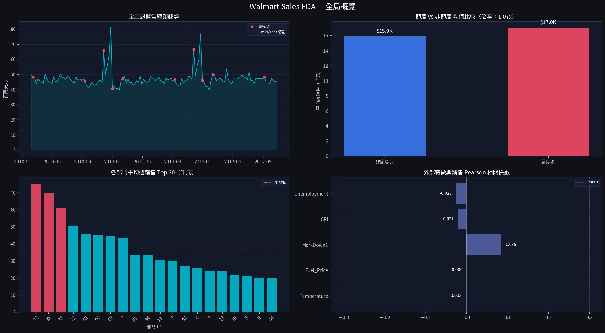
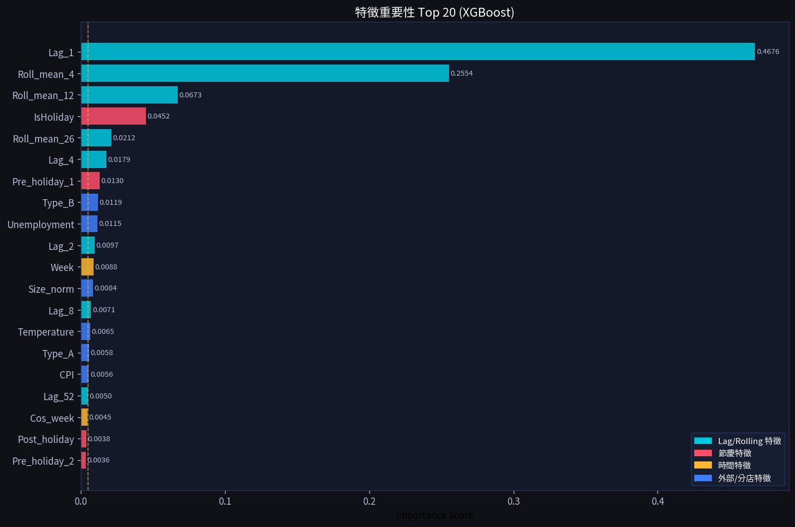
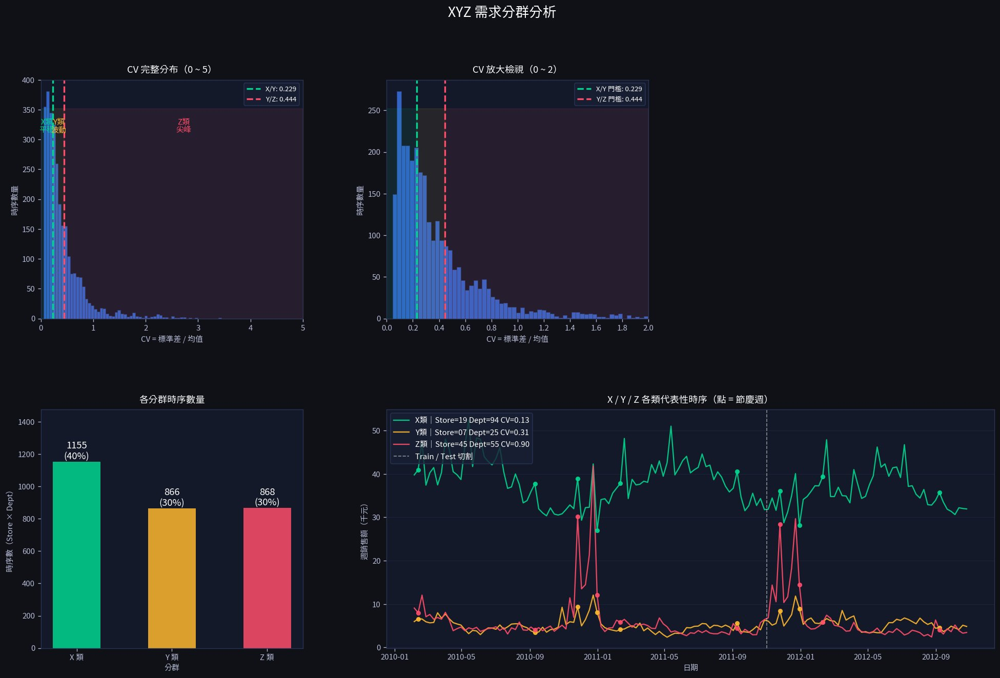
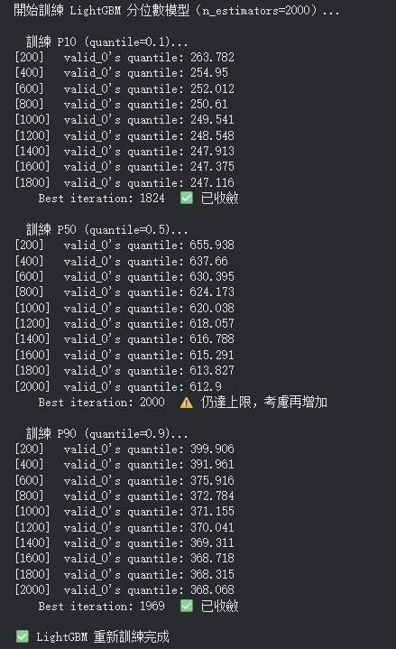
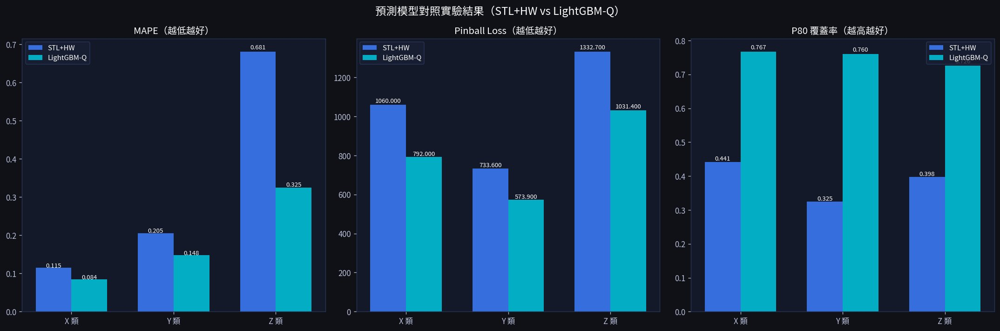
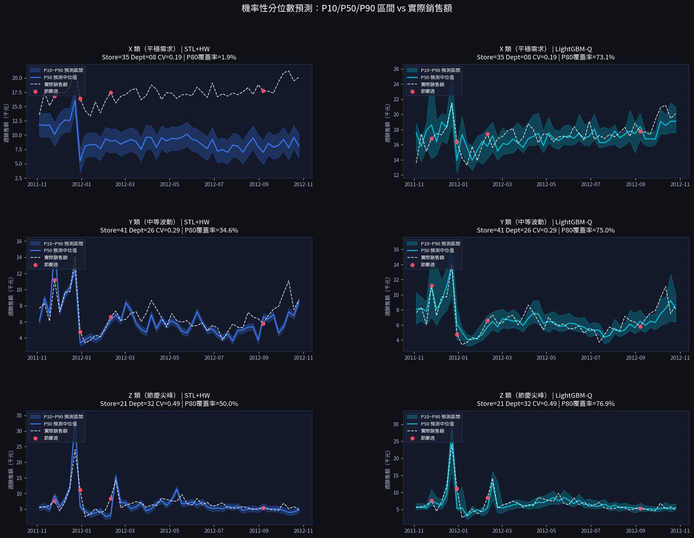

# 基於梯度提升之機率性分位數需求預測系統
## 2026 畢業專題參考
**Probabilistic Demand Forecasting via Gradient Boosting Quantile Regression**  
**以 Walmart 週銷售資料為實證的端對端機率預測框架**

---

| 項目 | 內容 |
|------|------|
| 資料集 | Kaggle Walmart Store Sales Forecasting |
| 資料規模 | 421,570 筆 ‧ 45 分店 ‧ 81 部門 ‧ 143 週 |
| 研究方法 | EDA → XYZ 需求分群 → 兩模型對照實驗 → 機率預測帶狀視覺化 |
| 開發工具 | Python 3 ‧ LightGBM ‧ statsmodels ‧ Streamlit ‧ Plotly |
| 展示平台 | Streamlit Community Cloud 互動式系統 |
| 系所 | 國立金門大學 工業工程與管理學系 |

---

## 摘要

本研究以 Walmart Store Sales 資料集為對象，提出以**機率性分位數預測**取代傳統點預測的需求預測框架。研究核心在於：傳統補貨模型假設需求分布靜態不變，但零售節慶旺季存在劇烈的非線性尖峰需求，此假設將導致系統性預測偏差並引發**長鞭效應（Bullwhip Effect）**。

本研究設計同時輸出 P10／P50／P90 三條預測曲線，量化每週需求的不確定性範圍；並以 XYZ 需求分群建立分層分析架構，驗證 LightGBM Quantile Regression 在各需求特性下的預測優勢。

**關鍵字**：機率性預測、分位數迴歸、LightGBM、Holt-Winters、XYZ 需求分群、Pinball Loss

---

## 一、研究背景與動機

零售供應鏈的核心挑戰在於需求的高度不確定性。Walmart 等大型量販通路在節慶旺季（感恩節、聖誕節）的週銷售額可在數週內暴增數倍。傳統統計預測方法建立在平穩性假設之上，面對非線性尖峰往往出現預測滯後。

現有研究多以提升點預測準確率（MAPE/RMSE）為目標，卻忽略了**補貨決策的本質是在不確定性下進行風險決策**。本研究旨在建立機率性分位數預測框架，同時量化需求的不確定性範圍，為後續動態補貨決策提供更完整的資訊基礎。

---

## 二、研究架構

```
資料取得 → EDA → 特徵工程（19 個） → XYZ 需求分群
        → 兩模型並行訓練（STL+HW / LightGBM-Q）
        → 2×3 對照實驗 → 機率預測帶狀圖 → Streamlit UI
```

---

## 三、探索性資料分析



*圖 3-1　全局概覽（左上：週銷售趨勢；右上：節慶倍率；左下：部門 Top 20；右下：外部特徵相關係數）*

**關鍵發現：**

| 觀察項目 | 結果 | 對研究設計的影響 |
|---------|------|----------------|
| 部門間異質性 | 部分部門均值超過 $50K，多數低於均線 | 需 XYZ 分群分層建模 |
| 節慶週尖峰 | Z 類部門節慶尖峰可達平時 5~6 倍 | 驗證非線性預測的必要性 |
| 外部特徵相關性 | MarkDown1 最高（r=0.085），其餘接近 0 | 整體解釋力弱，由模型自行學習 |
| 年度趨勢 | 2010→2012 銷售額微幅上升 | 納入 Year_idx 趨勢特徵 |

---

## 四、特徵工程



*圖 4-1　特徵重要性 Top 20（青色：Lag/Rolling；紅色：節慶；橙色：時間；藍色：外部）*

使用 XGBoost 計算特徵重要性，設定門檻 ≥ 0.005 自動保留，節慶特徵領域知識強制保留，最終確定 **19 個特徵**。Lag_1（重要性 0.4676）遠超其他特徵，上週銷售額為最強預測信號。

```python
FINAL_FEATURES = [
    'Lag_1', 'Roll_mean_4', 'Lag_52', 'Roll_mean_12',
    'Lag_4', 'Lag_2', 'Lag_8', 'Roll_std_4', 'Roll_std_12',
    'Roll_mean_26', 'Roll_std_26',
    'IsHoliday', 'Pre_holiday_1',   # 領域知識強制保留
    'Year_idx', 'Month', 'Week', 'Sin_week',
    'Temperature', 'Fuel_Price',
]
```

---

## 五、XYZ 需求分群



*圖 5-1　XYZ 需求分群（左上：CV 完整分布；右上：CV 放大 0~2；左下：各群時序數；右下：代表性時序）*

以變異係數（CV = 標準差 / 均值）分群，門檻依資料分位數動態設定（P40/P70）：

| 分群 | CV 門檻 | 時序數 | 佔比 | 代表性 |
|------|---------|--------|------|-------|
| X 類 | CV ≤ 0.229 | 1,155 | 40% | 食品、雜貨（平穩） |
| Y 類 | 0.229 < CV ≤ 0.444 | 866 | 30% | 服飾、家居（季節波動） |
| Z 類 | CV > 0.444 | 868 | 30% | 節慶禮品（尖峰劇烈） |

> 無效時序過濾：均值銷售額 < 100 的時序（停業/極稀疏）先排除再計算 CV，避免 CV = inf 扭曲門檻。

---

## 六、模型設計

### 基準模型：STL + Holt-Winters

原計畫使用純 Holt-Winters，但訓練期最長僅 91 週，statsmodels 要求 104 週，成功率 0%。修訂為 STL 季節分解 + HW 趨勢預測兩階段架構，成功率提升至 **94.1%**。

### 主力模型：LightGBM Quantile Regression



*圖 6-1　三個分位數模型的訓練收斂過程（P10 @ 1,939 輪、P50 @ 2,000 輪、P90 @ 1,908 輪）*

`min_delta = 0.5` 收斂設計：每輪 Pinball Loss 改善低於 0.5 視為無實質業務意義自動停止，避免過度訓練。

---

## 七、實驗結果

### 7.1 2×3 對照實驗矩陣



*圖 7-1　STL+HW vs LightGBM-Q（左：MAPE；中：Pinball Loss；右：P80 覆蓋率）*

| 分群 | 模型 | MAPE ↓ | Pinball P50 ↓ | Coverage P80 ↑ |
|------|------|--------|--------------|----------------|
| X 類 | STL+HW | 0.115 | 1,060 | 44.1% |
| X 類 | **LightGBM-Q** | **0.083** | **792** | **76.7%** |
| Y 類 | STL+HW | 0.205 | 734 | 32.5% |
| Y 類 | **LightGBM-Q** | **0.148** | **574** | **76.0%** |
| Z 類 | STL+HW | 0.681 | 1,333 | 39.7% |
| Z 類 | **LightGBM-Q** | **0.325** | **1,031** | **76.9%** |

LightGBM-Q 在 MAPE（3/3）、Pinball Loss（3/3）、Coverage Rate（3/3）三項全面勝出。

### 7.2 機率預測帶狀分布圖



*圖 7-2　P10/P50/P90 帶狀預測 vs 實際值（左欄：STL+HW；右欄：LightGBM-Q；上中下：X/Y/Z 類）*

LightGBM-Q 的帶狀寬度能隨需求不確定性動態調整——節慶週自動加寬，平穩期收窄；STL+HW 的帶狀寬度幾乎固定，無法反映節慶週的高不確定性。

### 7.3 研究假設驗證

| 假設 | 結果 | 數據支持 |
|------|------|---------|
| H1：Z 類 LightGBM-Q Pinball Loss 顯著低於 STL+HW | ✅ 支持 | 1,031 vs 1,333（低 22.6%） |
| H3：Coverage Rate 差距在 Z 類最顯著 | ⚠️ 部分支持 | Y 類差距最大（43.5%）→ 意外發現，值得論文討論 |

---

## 八、研究結論

**C1：機率預測優於點預測的核心在於不確定性量化**
LightGBM-Q 的 Coverage Rate 全分群超過 76%，STL+HW 僅 32~44%。

**C2：XYZ 分群驗證模型適配差異**
Z 類 MAPE 改善幅度（52.3%）遠大於 X 類（27.8%），驗證梯度提升對非線性尖峰的捕捉能力。

**C3：收斂控制具業務可解釋性**
`min_delta=0.5` 設計使訓練在業務意義上而非純數學意義上收斂。

---

## 九、未來發展：動態補貨決策系統

> 第一階段（機率性需求預測）已完成，第二階段規劃如下。

傳統補貨策略假設需求分布靜態不變，直接套用固定參數會加劇長鞭效應。正確設計邏輯是以每週動態更新的 P10/P50/P90 代入 **Newsvendor 報童模型**：

```
Q*_t = F_t^{-1}( Cu / (Cu + Co) )

F_t^{-1} = 第 t 週需求分位數函數（由 LightGBM-Q 估計）
Cu = 缺貨懲罰成本，Co = 過剩持有成本
```

越準確的機率預測 → 補貨決策越收斂，不再發散。

| 規劃功能 | 說明 |
|---------|------|
| Newsvendor 最佳訂購量 | 依 Cu/Co 即時計算 Q*_t |
| 動態安全庫存 | s_t = (P90_t − P50_t) × L |
| 三策略比較 | 固定(r,Q) / 固定(s,S) / 動態(s_t,S_t) |
| 成本敏感度分析 | UI 滑桿調整 h/b/α |
| H2 假設驗證 | 動態策略 vs 固定策略 Total Cost |

---

## 十、專案結構與部署

```
walmart-capstone/
├── app.py                  # Streamlit 主程式（四頁）
├── requirements.txt
├── README.md
├── assets/                 # 研究圖表
│   ├── fig1_eda_overview.png
│   ├── fig2_feature_importance.png
│   ├── fig3_xyz_analysis.png
│   ├── fig4_model_comparison.png
│   ├── fig5_prediction_bands.png
│   └── fig6_lgbm_convergence.png
└── data/
    └── predictions.csv     # 從 Colab 產出後放入（預設載入 Demo）
```

```bash
# 本機執行
pip install -r requirements.txt
streamlit run app.py
```

Streamlit Cloud 部署：[share.streamlit.io](https://share.streamlit.io) → New app → 選 repo → `app.py` → Deploy

---

## 參考文獻

1. Ke, G. et al. (2017). LightGBM. *NeurIPS*, 30.
2. Cleveland, R.B. et al. (1990). STL. *Journal of Official Statistics*, 6(1).
3. Gneiting, T. & Raftery, A.E. (2007). Strictly proper scoring rules. *JASA*, 102(477).
4. Hyndman, R.J. & Athanasopoulos, G. (2021). *Forecasting: Principles and Practice* (3rd ed.).
5. Bertsimas, D. & Kallus, N. (2020). From predictive to prescriptive analytics. *Management Science*, 66(3).
6. Scarf, H. (1960). The optimality of (s, S) policies. *Mathematical Methods in the Social Sciences*.

---

## [Streamlit UI 實作範例](https://walmart-capstone-wvpcnbdipthcsy6tk8tsbe.streamlit.app/)
